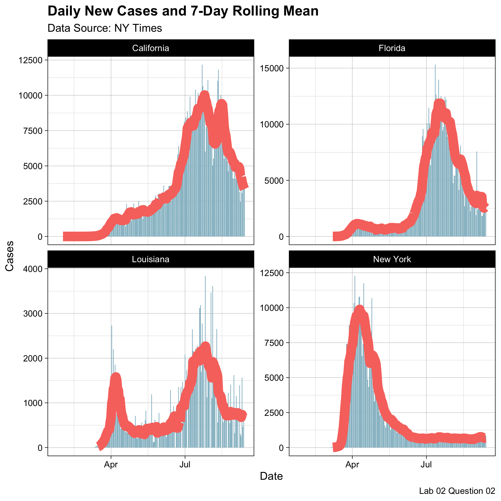
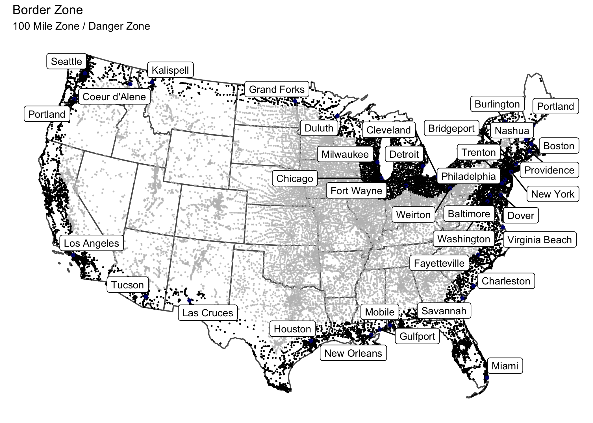
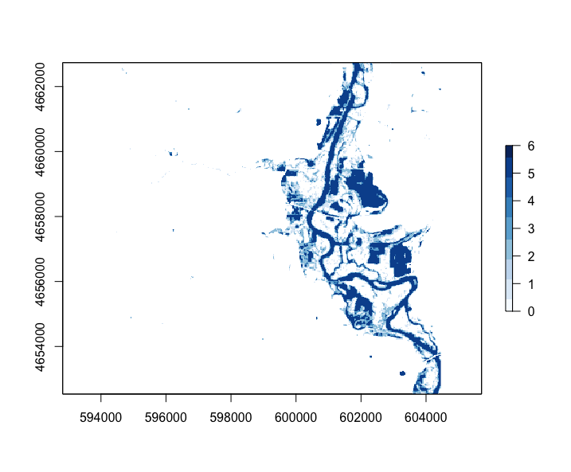
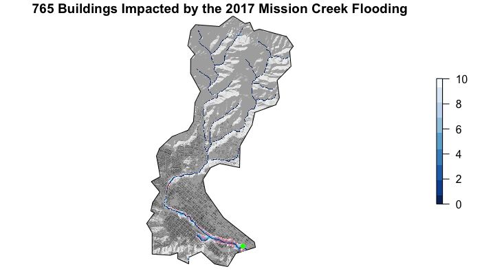

In Summer Session B of 2020, I took an introductory GIS course, Geog 176A. This class was based in the coding language, R. This is a list of the projects I have been working on. 

*****

#### [Building a project website](https://ktakeuchi2.github.io/)

- In this project, we created a website using Github Pages, where all of our work would be featured for this class.
- Through this project, we explored the uses of R Markdown, Viewer, and the 'knit' function to see our changes throughout the process.
- Includes a github repo for access to all the code.
- [github repo](https://github.com/ktakeuchi2/ktakeuchi2.github.io)

#### [Data Wrangling and Visualization of COVID-19 Data](https://ktakeuchi2.github.io/geog-176A-labs/lab02.html)

- This project involved analyzing real-time COVID-19 data from the NY-Times. 
- Skills developed included data frame manipulations and joins of datasets in order to produce reports of the most cumulative and new cases in US counties. 
- We then displayed this information using knitr tables and produced a 7-day rolling mean of new cases per capita counts.
- [github repo](https://github.com/ktakeuchi2/geog-176A-labs/blob/master/docs/lab02.Rmd)

{width="50%"}

#### [Projections, Distances, and Mapping](https://ktakeuchi2.github.io/geog-176A-labs/lab-03.html)

- This project explored the assessment made by ACLU stating that 2/3 of the USA population resides within the "Border Zone", the region within 100 miles of international borders, where rights protected by the 4th amendement are no longer being observed.
- Skills required for this project included working with simple feature objects, coordinate reference systems, and using meausurements to compute distances to counties, states, and countries.
- Finally, we created the "Border Zone" on a map and identified the most populated cities in this region, as well as the total population affected by policies in question.
- [github repo](https://github.com/ktakeuchi2/geog-176A-labs/blob/master/docs/lab-03.Rmd)

{width="50%"}

#### [Tesselations, Spatial Joins, and Point-in-Polygon of Dam Information](https://ktakeuchi2.github.io/geog-176A-labs/lab-04.html)

- This project addresses dam distribution and purposes across the USA using data from the US Army Corp of Engineers National Dam Inventory.
- We explored the uses of different tesselations (voronoi, triangulated, gridded, and hexagonal) and how they vary visually.
- We then used point-in-polygon functions to analyze dam distribution and purpose. 
- [github repo](https://github.com/ktakeuchi2/geog-176A-labs/blob/master/docs/lab-04.Rmd)

#### [Raster Analysis of Flooding near Palo, Iowa](https://ktakeuchi2.github.io/geog-176A-labs/lab05)

- This project addresses the issues of flooding near Palo, Iowa.
- Skills include categorization of raster data to create stacked flood images from multiple methods. These included using Landsat images and manipulating Landsat RGB channels to highlight visual features in the images, creating thresholds for surface water flooding (NDVI, NDWI, MNDWI, WRI, and SWI), and through supervised and unsupervised classification using kmeans algorithms.
- The flooding area was then mapped using mapview to create an interactive map.
- [github repo](https://github.com/ktakeuchi2/geog-176A-labs/blob/master/docs/lab-05.Rmd)

{width="50%"}

#### [Terrain Analysis of Santa Barbara](https://ktakeuchi2.github.io/geog-176A-labs/lab-06.html)

- This project seeks to identify buildings affected in Santa Barbara due to the flooding along Mission Creek.
- Whitebox is used to create rasters of the hillshade, and HAND (Height Above Nearest Drainage), which allows us to identify elevation levels affected by flooding, the buildings on these levels, as well as lower levels also impacted. 
- We then created a FIM (Flooding Inundation Map) Library for the Mission Creek Basin to create a flood warning system.
- [github repo](https://github.com/ktakeuchi2/geog-176A-labs/blob/master/docs/lab-06.Rmd)

{width="50%"}
